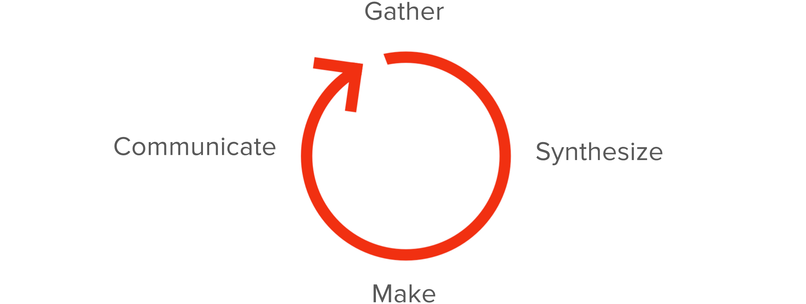
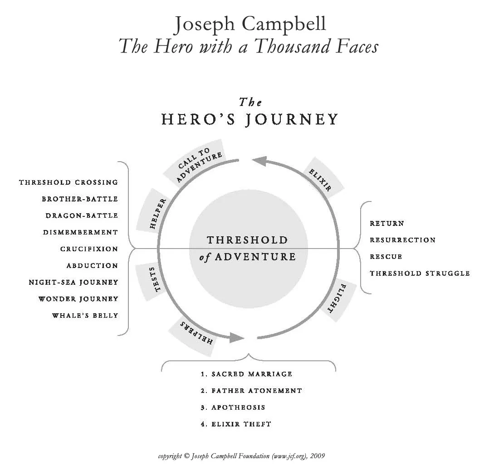

I'm a fan of "just enough" process, which is part of why I love the elegant simplicity of Buzzfeed’s [Design Loop](https://medium.com/buzzfeed-design/introducing-buzzfeeds-design-process-4fefbdcd83ea):

This is a well-established way of thinking about what good design process looks like at the micro level. Lots of design and product orgs converge on a circular process that feeds back into the next iteration of the loop. As a designer I like the loop for that exact reason: it de-linearizes our process, placing the emphasis on continuous learning rather than arriving at a final destination.

Since they initially shared it in 2016, Buzzfeed's design loop has helped me so much that I've fully internalized it. But last week when I went back to re-read the article, I noticed that Buzzfeed's loop resembles another loop I’m fond of:

For those who know Joseph Campbell’s work on mythology, please excuse a couple paragraphs of crude explanation. For everyone else, let’s start with a description from the man himself:

> “The basic motif of the hero journey [is] leaving one condition, finding the source of life to bring you forth in a richer or more mature or other condition.“

Campbell identified the hero's journey as a common template across all mythological traditions. It's an archetype that helps illuminate a path for humanity to follow when faced with inevitable challenges. Following the path of the hero's journey transforms our fear into a state of heightened connectedness and fullness of potential.

For Campbell, the transformation happens when the hero crosses the threshold of adventure, venturing deep into the unknown, slaying beasts and uncovering new knowledge or powers that they then share with the world by crossing back over the threshold and giving their "boon" back to their community.
